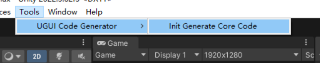
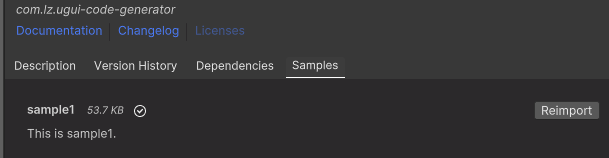
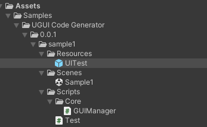
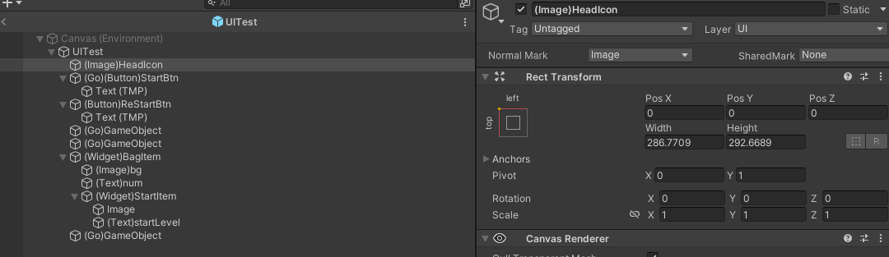
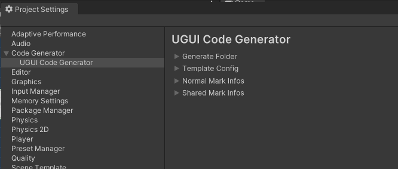
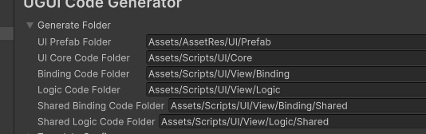
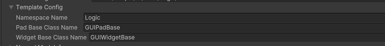
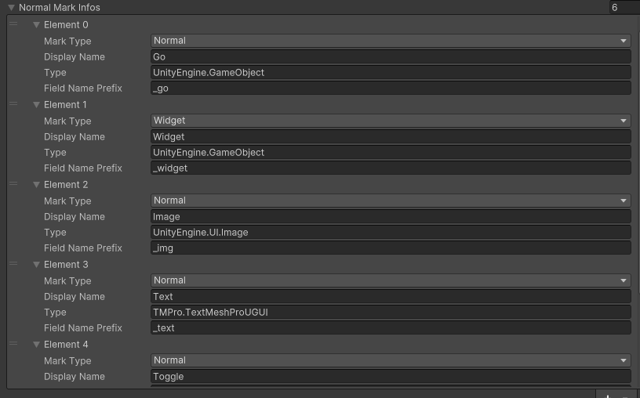

# UGUI Code Generator

## 简介

UGUI Code Generator是一个根据预制生成绑定代码的工具。

## 快速开始

#### 1.首先在菜单上点击Tools -> UGUI Code Generator -> Init Generate Core Code生成核心代码。

#### 2.导入Sample1案例

#### 3.找到UITest预制

#### 4.右键 UGUI Code Generator -> Pad Code就会生成代码

## 生成规则

 选择对应的GameObject后Inpector界面会出现NormalMark和SharedMark的下拉菜单。

NormalMark是一些UGUI中的常用组件匹配标记，而SharedMark中是一些自定义的具有共用的组件。

这两种匹配标记可以在ProjectSettings -> Code Generator - >UGUI Code Generator中配置

## 生成的代码

#### 1.Pad Code

生成的是面板的代码。

#### 2.Widget Code

生成的是面板中的控件的代码，例如背包面板中的有许多小的Item，那么这个Item就可以是一个控件(Widget)。

## 配置

#### 1.Generator Folder

生成代码后存放的目录。

#### 2.Template Config

命名空间，面板父类，控件(Widget)父类

#### 3.Normal Mark Infos

UGUI中的一些组件，以及GameObject，Widget(不通用的控件)，这里只加了一部分，有需要可以自己添加

**MarkType**:标记类型

**DisplayName**:标记名，也是用于显示在下拉菜单中的

**Type**:对应的组件类型（对于Widget和SharedWidget这里可以不填，也可以填UnityEngine.GameObject）

**FieldNamePrefix**:生成后的字段名前缀（SharedWidget不用填）

###### 

#### 4.Share Mark Infos

可以共用的控件（Widget）。
